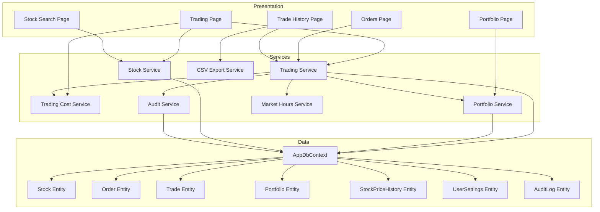
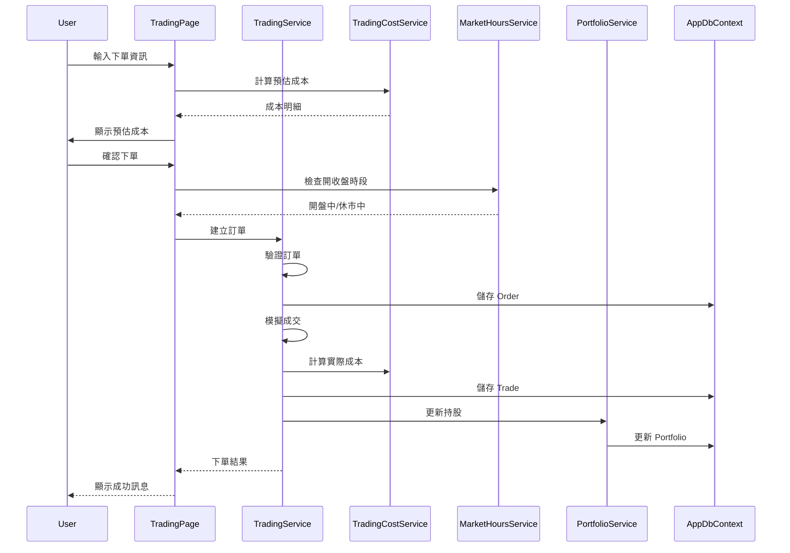
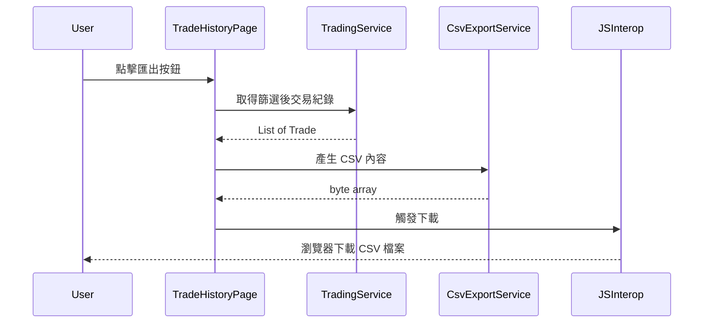
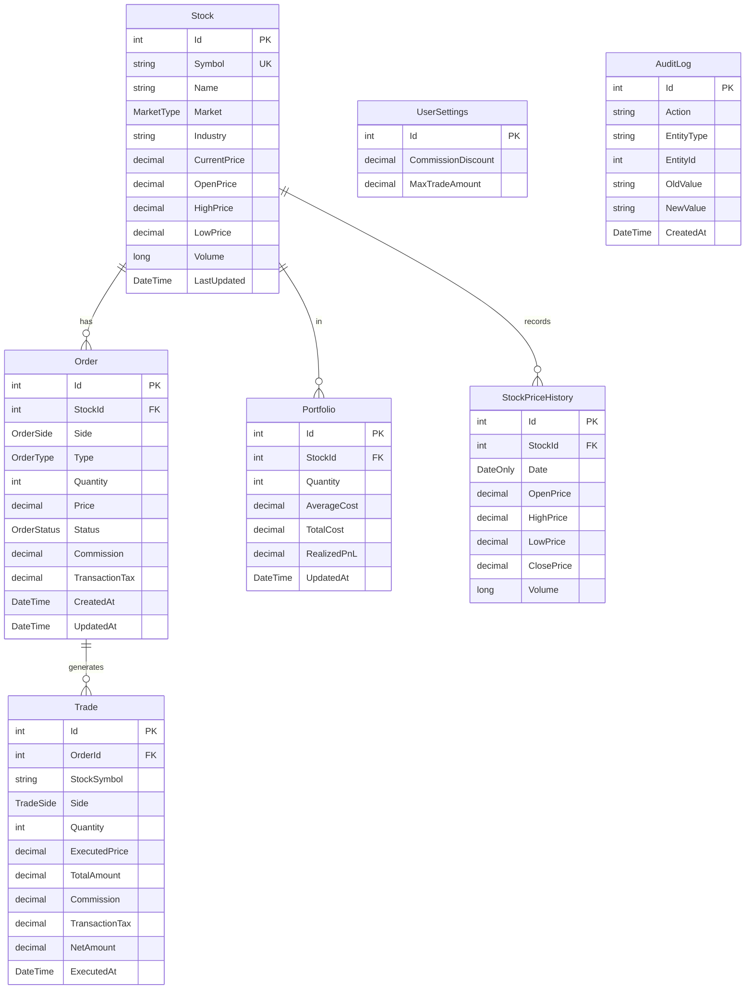

# 技術設計文件：股票交易功能

## Overview

**Purpose**: 本功能為 MyStockApp 提供完整的股票交易管理能力，包含下單、訂單管理、交易成本計算、持股部位追蹤與歷史紀錄查詢。

**Users**: 個人投資者透過 Web 介面進行股票買賣操作、查詢持股損益與匯出交易報表。

**Impact**: 擴充現有 Blazor Server 應用，新增交易領域的資料模型、業務服務與頁面元件。

### Goals
- 實現台股買賣下單功能，支援市價單與限價單
- 精確計算交易成本（手續費、證券交易稅），符合台灣券商規則
- 提供持股部位與損益即時計算
- 支援交易紀錄查詢與 CSV 匯出

### Non-Goals
- 即時股價串接（第三方 API 整合）— 本階段使用模擬/手動輸入
- 多用戶帳號系統 — 本階段為單用戶模式
- 自動化交易或程式交易功能
- 融資融券等進階交易類型

## Architecture

### Existing Architecture Analysis

**Current Patterns**:
- Blazor Server 單體架構，SignalR 即時通訊
- `IDbContextFactory<AppDbContext>` 資料存取模式
- 業務邏輯直接在 Razor 元件實作（待改善）
- Bootstrap 5 UI 框架

**Integration Points**:
- `AppDbContext` — 擴充 DbSet
- `NavMenu.razor` — 新增導航項目
- `Program.cs` — 服務註冊

**Technical Debt Addressed**:
- 導入服務層模式，分離業務邏輯與 UI

### Architecture Pattern & Boundary Map



**Architecture Integration**:
- **Selected pattern**: Layered Architecture + Service Interfaces（分層架構搭配服務介面）
- **Domain boundaries**: Trading Domain（訂單/成交）、Stock Domain（股票資料）、Portfolio Domain（持股）
- **Existing patterns preserved**: IDbContextFactory 模式、Data Annotations 驗證
- **New components rationale**: 服務層封裝複雜業務邏輯，提升可測試性
- **Steering compliance**: 遵循 Blazor Server 架構、C# 命名慣例、強型別設計

### Technology Stack

| Layer | Choice / Version | Role in Feature | Notes |
|-------|------------------|-----------------|-------|
| Frontend | Blazor Server (.NET 10) | 互動式交易頁面、即時更新 | 現有技術延續 |
| Backend | ASP.NET Core 10.0 | 服務層、依賴注入 | 新增 Services 目錄 |
| Data | PostgreSQL + EF Core 10.0 | 訂單/交易/持股資料持久化 | 擴充 AppDbContext |
| CSV Export | CsvHelper 31.x | 交易紀錄匯出 | 新增 NuGet 套件 |
| JS Interop | 自訂 fileDownload.js | 觸發瀏覽器檔案下載 | 新增 wwwroot/js |

## System Flows

### 下單流程



**Key Decisions**:
- 市價單立即模擬成交，限價單保持待成交狀態
- 成本計算在下單前預估、成交後精算
- 休市時段允許下單但標記為「待處理」

### CSV 匯出流程



## Requirements Traceability

| Requirement | Summary | Components | Interfaces | Flows |
|-------------|---------|------------|------------|-------|
| 1.1, 1.2 | 建立買入/賣出訂單 | TradingPage, TradingService | ITradingService.CreateOrderAsync | 下單流程 |
| 1.3, 1.4 | 數量驗證、持股檢查 | TradingService | ITradingService.ValidateOrder | 下單流程 |
| 1.5 | 處理中狀態顯示 | TradingPage | - | - |
| 2.1, 2.2 | 市價單/限價單支援 | Order Entity, TradingPage | OrderType Enum | 下單流程 |
| 2.3, 2.4, 2.5 | 限價單價格欄位邏輯 | TradingPage | - | - |
| 3.1 | 訂單清單顯示 | OrdersPage, TradingService | ITradingService.GetOrdersAsync | - |
| 3.2, 3.3 | 取消訂單、狀態限制 | TradingService | ITradingService.CancelOrderAsync | - |
| 3.4 | 即時狀態更新 | OrdersPage | SignalR | - |
| 3.5 | 訂單狀態篩選 | OrdersPage | - | - |
| 4.1 | 交易紀錄顯示（含成本） | TradeHistoryPage, TradingService | ITradingService.GetTradesAsync | - |
| 4.2, 4.3 | 日期/股票篩選 | TradeHistoryPage | - | - |
| 4.4 | CSV 匯出 | CsvExportService | ICsvExportService.ExportTradesAsync | CSV 匯出流程 |
| 4.5 | 排序 | TradingService | - | - |
| 5.1 | 持股部位顯示 | PortfolioPage, PortfolioService | IPortfolioService.GetPortfolioAsync | - |
| 5.2, 5.3 | 損益/報酬率計算 | PortfolioService, TradingCostService | IPortfolioService.CalculatePnL | - |
| 5.4 | 股價更新時重算 | PortfolioPage | - | - |
| 5.5 | 總市值/總損益 | PortfolioPage, PortfolioService | - | - |
| 6.1 | 股票代號驗證 | TradingService, StockService | IStockService.GetStockAsync | 下單流程 |
| 6.2 | 金額上限警告 | TradingService, UserSettings | ITradingService.ValidateOrder | - |
| 6.3 | 稽核日誌 | AuditService | IAuditService.LogAsync | - |
| 6.4 | 休市提示 | MarketHoursService, TradingPage | IMarketHoursService.IsMarketOpen | 下單流程 |
| 6.5 | 防重複提交 | TradingPage | - | - |
| 7.1-7.8 | 交易成本計算 | TradingCostService | ITradingCostService | 下單流程 |
| 8.1-8.6 | 股票基本資料管理 | StockService, Stock Entity | IStockService | - |
| 9.1-9.6 | 股價歷史資料 | StockService, StockPriceHistory | IStockService | - |

## Components and Interfaces

| Component | Domain/Layer | Intent | Req Coverage | Key Dependencies | Contracts |
|-----------|--------------|--------|--------------|------------------|-----------|
| TradingService | Trading/Service | 下單處理與訂單管理 | 1.1-1.5, 3.1-3.5, 4.1-4.5, 6.1-6.5 | TradingCostService (P0), PortfolioService (P0), StockService (P0) | Service |
| TradingCostService | Trading/Service | 手續費與交易稅計算 | 7.1-7.8 | UserSettings (P1) | Service |
| PortfolioService | Portfolio/Service | 持股計算與損益分析 | 5.1-5.5 | TradingCostService (P0), StockService (P1) | Service |
| StockService | Stock/Service | 股票資料與報價管理 | 8.1-8.6, 9.1-9.6 | - | Service |
| AuditService | Audit/Service | 稽核日誌記錄 | 6.3 | - | Service |
| CsvExportService | Export/Service | CSV 檔案產生與下載 | 4.4 | JSInterop (P0) | Service |
| MarketHoursService | Trading/Service | 台股開收盤時段判斷 | 6.4 | - | Service |
| TradingPage | Trading/UI | 股票下單介面 | 1.1-1.5, 2.1-2.5, 6.4, 7.6 | TradingService, TradingCostService | - |
| OrdersPage | Trading/UI | 訂單管理介面 | 3.1-3.5 | TradingService | - |
| PortfolioPage | Portfolio/UI | 持股部位介面 | 5.1-5.5 | PortfolioService | - |
| TradeHistoryPage | Trading/UI | 交易紀錄介面 | 4.1-4.5 | TradingService, CsvExportService | - |

### Trading Domain

#### TradingService

| Field | Detail |
|-------|--------|
| Intent | 處理股票下單、訂單狀態管理與成交記錄 |
| Requirements | 1.1-1.5, 3.1-3.5, 4.1-4.5, 6.1-6.5 |

**Responsibilities & Constraints**
- 建立與驗證訂單（買入/賣出、市價/限價）
- 管理訂單狀態流轉（待成交 → 已成交/已取消）
- 記錄成交明細與計算實際成本
- 交易聚合根，確保訂單與成交的交易一致性

**Dependencies**
- Inbound: TradingPage, OrdersPage, TradeHistoryPage — 頁面呼叫 (P0)
- Outbound: TradingCostService — 成本計算 (P0)
- Outbound: PortfolioService — 持股更新 (P0)
- Outbound: StockService — 股票驗證與報價 (P0)
- Outbound: AuditService — 稽核記錄 (P1)
- Outbound: MarketHoursService — 休市判斷 (P1)
- External: IDbContextFactory — 資料存取 (P0)

**Contracts**: Service [x]

##### Service Interface
```csharp
public interface ITradingService
{
    Task<Result<Order, TradingError>> CreateOrderAsync(CreateOrderRequest request);
    Task<Result<Order, TradingError>> CancelOrderAsync(int orderId);
    Task<IReadOnlyList<Order>> GetOrdersAsync(OrderFilter? filter = null);
    Task<IReadOnlyList<Trade>> GetTradesAsync(TradeFilter? filter = null);
    Task<Order?> GetOrderByIdAsync(int orderId);
}

public record CreateOrderRequest(
    int StockId,
    OrderSide Side,
    OrderType Type,
    int Quantity,
    decimal? LimitPrice = null
);

public record OrderFilter(
    OrderStatus? Status = null,
    int? StockId = null,
    DateTime? FromDate = null,
    DateTime? ToDate = null
);

public record TradeFilter(
    string? StockSymbol = null,
    DateTime? FromDate = null,
    DateTime? ToDate = null
);

public enum TradingError
{
    InvalidQuantity,
    InsufficientHoldings,
    InvalidStock,
    InvalidLimitPrice,
    OrderNotFound,
    OrderNotCancellable,
    DuplicateOrder
}
```
- Preconditions: StockId 有效、Quantity > 0、限價單需提供 LimitPrice
- Postconditions: 成功時 Order/Trade 已持久化、Portfolio 已更新
- Invariants: 賣出數量不超過持股數量

**Implementation Notes**
- Integration: 使用 IDbContextFactory 建立短生命週期 DbContext
- Validation: 先驗證再執行，失敗快速返回錯誤
- Risks: 併發下單可能導致超賣，需加入樂觀鎖或庫存檢查

---

#### TradingCostService

| Field | Detail |
|-------|--------|
| Intent | 計算交易手續費與證券交易稅 |
| Requirements | 7.1-7.8 |

**Responsibilities & Constraints**
- 根據成交金額計算手續費（0.1425% × 折扣）
- 套用最低手續費門檻（20 元）
- 計算賣出交易稅（0.3%）
- 純計算服務，無狀態

**Dependencies**
- Inbound: TradingService, TradingPage, PortfolioService — 成本計算需求 (P0)
- External: UserSettings（折扣比例）— 透過參數傳入或 IDbContextFactory 查詢 (P1)

**Contracts**: Service [x]

##### Service Interface
```csharp
public interface ITradingCostService
{
    /// <summary>計算手續費（已套用最低門檻）</summary>
    decimal CalculateCommission(decimal amount, decimal discountRate = 0.6m);

    /// <summary>計算證券交易稅（僅賣出適用）</summary>
    decimal CalculateTransactionTax(decimal amount);

    /// <summary>計算完整交易成本</summary>
    TradingCost CalculateTotalCost(decimal amount, TradeSide side, decimal discountRate = 0.6m);

    /// <summary>預估持股損益（含賣出成本）</summary>
    PnLEstimate EstimatePnL(decimal currentPrice, int quantity, decimal averageCost, decimal discountRate = 0.6m);
}

public record TradingCost(
    decimal Commission,
    decimal TransactionTax,
    decimal TotalCost
);

public record PnLEstimate(
    decimal MarketValue,
    decimal TotalCost,
    decimal UnrealizedPnL,
    decimal ReturnRate
);

public enum TradeSide { Buy, Sell }
```
- Preconditions: amount >= 0、0.1 <= discountRate <= 1.0
- Postconditions: 回傳值皆為 decimal 精度
- Invariants: Commission >= 20、TransactionTax 僅賣出時 > 0

**Implementation Notes**
- Validation: 驗證折扣範圍（1 折至 10 折）
- Risks: 浮點數精度問題，使用 decimal 類型確保準確

---

#### MarketHoursService

| Field | Detail |
|-------|--------|
| Intent | 判斷台股市場開收盤時段 |
| Requirements | 6.4 |

**Responsibilities & Constraints**
- 判斷當前是否為交易時段（週一至週五 09:00-13:25）
- 維護假日清單
- 純函式計算，可快取假日資料

**Dependencies**
- Inbound: TradingService, TradingPage — 休市判斷 (P1)

**Contracts**: Service [x]

##### Service Interface
```csharp
public interface IMarketHoursService
{
    bool IsMarketOpen(DateTime? dateTime = null);
    DateTime? GetNextMarketOpen(DateTime? from = null);
    bool IsHoliday(DateOnly date);
}
```
- Preconditions: 無
- Postconditions: 基於台北時區判斷
- Invariants: 週末與假日永遠返回休市

---

### Portfolio Domain

#### PortfolioService

| Field | Detail |
|-------|--------|
| Intent | 管理持股部位與計算損益 |
| Requirements | 5.1-5.5 |

**Responsibilities & Constraints**
- 計算並更新平均持股成本（加權平均）
- 計算未實現損益與報酬率
- 更新已實現損益
- Portfolio 為聚合根

**Dependencies**
- Inbound: TradingService — 成交後更新持股 (P0)
- Inbound: PortfolioPage — 持股查詢 (P0)
- Outbound: TradingCostService — 損益計算含成本 (P0)
- Outbound: StockService — 取得當前股價 (P1)
- External: IDbContextFactory — 資料存取 (P0)

**Contracts**: Service [x]

##### Service Interface
```csharp
public interface IPortfolioService
{
    Task<IReadOnlyList<PortfolioItem>> GetPortfolioAsync();
    Task<PortfolioSummary> GetPortfolioSummaryAsync();
    Task UpdatePortfolioAsync(int stockId, int quantityChange, decimal price, TradeSide side, decimal commission);
}

public record PortfolioItem(
    int StockId,
    string StockSymbol,
    string StockName,
    int Quantity,
    decimal AverageCost,
    decimal CurrentPrice,
    decimal MarketValue,
    decimal UnrealizedPnL,
    decimal ReturnRate
);

public record PortfolioSummary(
    decimal TotalMarketValue,
    decimal TotalCost,
    decimal TotalUnrealizedPnL,
    decimal TotalRealizedPnL,
    decimal TotalReturnRate
);
```

---

### Stock Domain

#### StockService

| Field | Detail |
|-------|--------|
| Intent | 管理股票基本資料、報價與歷史價格 |
| Requirements | 8.1-8.6, 9.1-9.6 |

**Responsibilities & Constraints**
- 股票基本資料 CRUD
- 報價資料更新與查詢
- 歷史價格儲存與統計
- 股票搜尋（代號/名稱模糊查詢）

**Dependencies**
- Inbound: TradingService, PortfolioService, StockSearchPage — 股票查詢 (P0)
- External: IDbContextFactory — 資料存取 (P0)

**Contracts**: Service [x]

##### Service Interface
```csharp
public interface IStockService
{
    Task<Stock?> GetStockAsync(int stockId);
    Task<Stock?> GetStockBySymbolAsync(string symbol);
    Task<IReadOnlyList<Stock>> SearchStocksAsync(string? keyword = null, MarketType? market = null, string? industry = null);
    Task<IReadOnlyList<StockPriceHistory>> GetPriceHistoryAsync(int stockId, DateOnly fromDate, DateOnly toDate);
    Task<PriceStatistics> CalculatePriceStatisticsAsync(int stockId, DateOnly fromDate, DateOnly toDate);
    Task UpdateStockQuoteAsync(int stockId, StockQuote quote);
}

public record StockQuote(
    decimal CurrentPrice,
    decimal OpenPrice,
    decimal HighPrice,
    decimal LowPrice,
    long Volume,
    DateTime UpdatedAt
);

public record PriceStatistics(
    decimal HighestPrice,
    decimal LowestPrice,
    decimal AveragePrice,
    decimal PriceChange,
    decimal ChangePercent
);

public enum MarketType { Listed, OTC }
```

---

### Export Domain

#### CsvExportService

| Field | Detail |
|-------|--------|
| Intent | 產生 CSV 格式檔案並觸發瀏覽器下載 |
| Requirements | 4.4 |

**Responsibilities & Constraints**
- 使用 CsvHelper 產生 CSV 內容
- 透過 JavaScript Interop 觸發下載
- 處理大量資料時使用串流

**Dependencies**
- Inbound: TradeHistoryPage — 匯出請求 (P0)
- External: IJSRuntime — JavaScript Interop (P0)
- External: CsvHelper — CSV 產生 (P0)

**Contracts**: Service [x]

##### Service Interface
```csharp
public interface ICsvExportService
{
    Task ExportTradesAsync(IEnumerable<Trade> trades, string fileName = "trades.csv");
}
```

---

### Audit Domain

#### AuditService

| Field | Detail |
|-------|--------|
| Intent | 記錄所有交易操作至稽核日誌 |
| Requirements | 6.3 |

**Contracts**: Service [x]

##### Service Interface
```csharp
public interface IAuditService
{
    Task LogAsync(string action, string entityType, int entityId, object? oldValue = null, object? newValue = null);
}
```

## Data Models

### Domain Model



### Logical Data Model

**Entities & Relationships**:
- Stock (1) → Order (N): 一檔股票可有多筆訂單
- Stock (1) → Portfolio (1): 每檔股票最多一筆持股記錄
- Stock (1) → StockPriceHistory (N): 每檔股票有多筆歷史價格
- Order (1) → Trade (N): 一筆訂單可能分批成交

**Constraints**:
- Stock.Symbol: Unique
- Order.Status 流轉: Pending → Executed | Cancelled
- Portfolio.Quantity >= 0

### Physical Data Model

**Tables**:

| Table | Key Columns | Indexes | Notes |
|-------|-------------|---------|-------|
| Stocks | Id (PK), Symbol (UK) | IX_Symbol | 股票基本資料 |
| Orders | Id (PK), StockId (FK) | IX_StockId_Status, IX_CreatedAt | 訂單記錄 |
| Trades | Id (PK), OrderId (FK) | IX_ExecutedAt, IX_StockSymbol | 成交記錄 |
| Portfolios | Id (PK), StockId (FK, UK) | - | 持股部位 |
| StockPriceHistories | Id (PK), StockId (FK) | IX_StockId_Date | 歷史價格 |
| UserSettings | Id (PK) | - | 使用者設定 |
| AuditLogs | Id (PK) | IX_CreatedAt, IX_EntityType | 稽核日誌 |

**Data Types**:
- 金額欄位: decimal(18, 4)
- 日期時間: timestamp with time zone
- 枚舉: 儲存為 int

## Error Handling

### Error Strategy
- 使用 `Result<T, E>` 模式回傳業務錯誤，避免例外控制流程
- UI 層捕捉錯誤並顯示友善訊息
- 系統例外記錄至 Console/Logger

### Error Categories and Responses

**User Errors (4xx)**:
- 無效數量 → 「請輸入有效的交易數量」
- 持股不足 → 「賣出數量不可超過持有股數」
- 限價未填 → 「限價單必須指定價格」

**Business Logic Errors (422)**:
- 股票不存在 → 「查無此股票代號」
- 訂單無法取消 → 「訂單已成交或已取消，無法取消」
- 重複提交 → 「請勿重複提交訂單」

**System Errors (5xx)**:
- 資料庫錯誤 → 記錄日誌，顯示「系統錯誤，請稍後再試」

## Testing Strategy

### Unit Tests
- TradingCostService: 手續費計算（一般/最低門檻/大額）、交易稅計算、損益計算
- PortfolioService: 平均成本計算（買入/賣出）、報酬率計算
- MarketHoursService: 開盤/休市/假日判斷
- Order 驗證邏輯: 數量驗證、限價單驗證

### Integration Tests
- TradingService + AppDbContext: 完整下單流程
- PortfolioService + TradingService: 持股更新流程
- CsvExportService: CSV 產生內容驗證

### E2E Tests
- 下單頁面: 輸入 → 預估成本 → 確認 → 成功訊息
- 訂單管理: 顯示清單 → 取消訂單 → 狀態更新
- 交易紀錄: 篩選 → 匯出 CSV

## Migration Strategy

### Database Migration

**Phase 1: Schema Creation**
```bash
dotnet ef migrations add AddTradingEntities
dotnet ef database update
```

**New Tables**: Stocks, Orders, Trades, Portfolios, StockPriceHistories, UserSettings, AuditLogs

**Rollback**: 標準 EF Core 回滾機制

### Service Registration

**Program.cs additions**:
```csharp
// Trading Services
builder.Services.AddScoped<ITradingService, TradingService>();
builder.Services.AddScoped<ITradingCostService, TradingCostService>();
builder.Services.AddScoped<IPortfolioService, PortfolioService>();
builder.Services.AddScoped<IStockService, StockService>();
builder.Services.AddScoped<IAuditService, AuditService>();
builder.Services.AddScoped<ICsvExportService, CsvExportService>();
builder.Services.AddSingleton<IMarketHoursService, MarketHoursService>();
```
