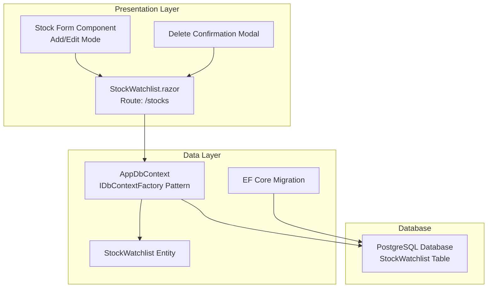
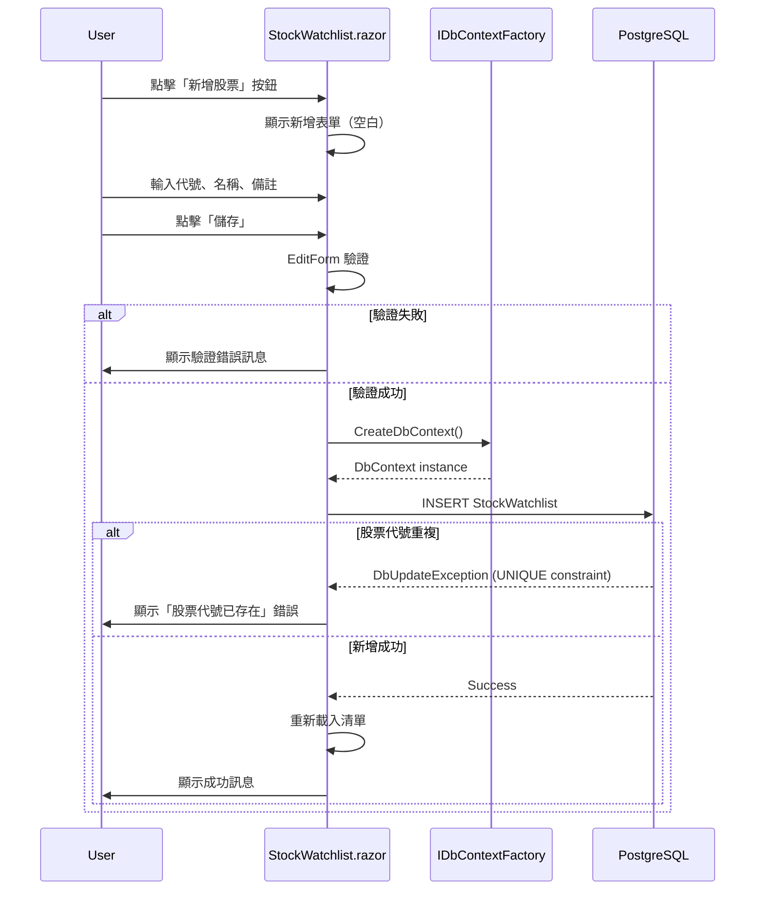
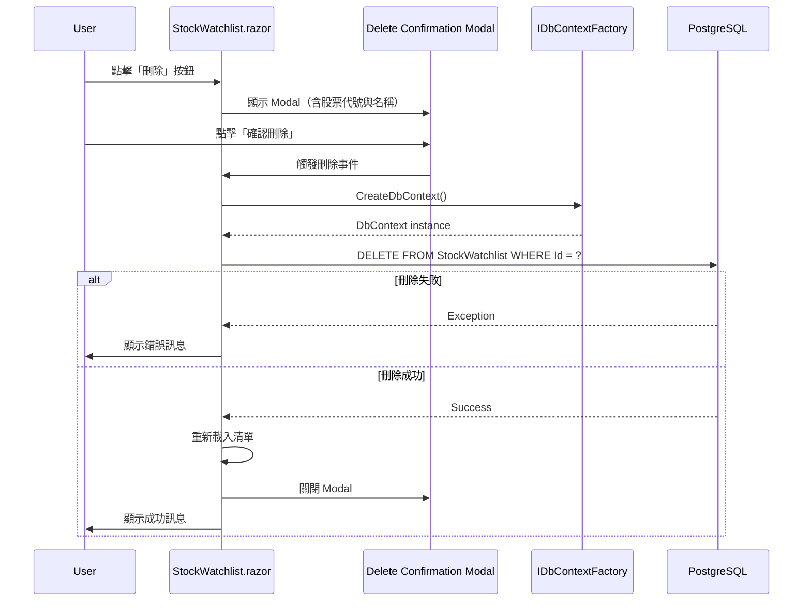

# Technical Design Document

## Overview

本功能為 MyStockApp 新增台股股票追蹤清單的完整 CRUD 能力，讓使用者透過 Blazor Server 互動式界面管理個人追蹤的台股項目。使用者可新增股票代號、名稱與備註至追蹤清單，查看所有追蹤項目，編輯既有項目資訊，以及刪除不再需要的追蹤項目。所有資料透過 Entity Framework Core 持久化至 PostgreSQL 資料庫，支援本地開發與雲端部署環境。

**Purpose**: 提供使用者輕量級的股票追蹤清單管理功能，作為後續股票資訊查詢與分析功能的基礎。

**Users**: 個人投資者透過瀏覽器存取，用於建立與維護個人化的台股追蹤清單。

**Impact**: 擴充既有 MyStockApp 應用程式，新增資料模型、頁面與資料庫結構，不影響現有功能。

### Goals
- 實作完整的股票追蹤清單 CRUD 功能（新增、查詢、更新、刪除）
- 提供直覺的單頁 Blazor 界面，支援表單驗證與錯誤處理
- 確保資料持久化至 PostgreSQL，支援跨環境部署
- 遵循既有架構模式與程式碼慣例

### Non-Goals
- 即時股價查詢與顯示（未來功能）
- 多使用者權限管理與資料隔離（目前為單使用者場景）
- 股票組合績效分析與報表（未來功能）
- RESTful API 端點（目前僅 Blazor Server 內部使用）

## Architecture

### Existing Architecture Analysis

MyStockApp 為 Blazor Server 單體應用程式，架構特徵如下：

- **Component-First**: 頁面位於 `/Components/Pages/`，使用 `@page` 指令路由
- **Data Layer**: AppDbContext 位於 `/Data/`，已配置 IDbContextFactory 模式
- **Dependency Injection**: 服務註冊集中於 Program.cs
- **Error Handling**: 集中式錯誤頁面（Error.razor）與連線中斷處理（ReconnectModal.razor）
- **Styling**: Bootstrap 5 框架已整合於 wwwroot/lib/bootstrap/

本功能擴充既有架構，新增：
- Entity: `StockWatchlist` 於 `/Data/Models/`
- Page: `StockWatchlist.razor` 於 `/Components/Pages/`
- Migration: EF Core Migration 檔案

### Architecture Pattern & Boundary Map



**Architecture Integration**:
- **Selected pattern**: Page-Level State Management（狀態與邏輯封裝於 Blazor Page 元件）
- **Domain/feature boundaries**: 股票追蹤清單為獨立功能域，未來可擴充為 Service Layer 以支援 API 或多頁面共用
- **Existing patterns preserved**: 遵循既有 Counter.razor / Weather.razor 的 Page 模式，使用 DbContextFactory 注入
- **New components rationale**:
  - `StockWatchlist.razor`: 主頁面，整合 CRUD 邏輯與 UI
  - `StockWatchlist` Entity: 資料模型，對應資料庫表格
  - Migration: 資料庫結構變更管理
- **Steering compliance**: 遵循 Component-First Architecture, PascalCase 命名, DbContextFactory 模式

### Technology Stack

| Layer | Choice / Version | Role in Feature | Notes |
|-------|------------------|-----------------|-------|
| Frontend / UI | Blazor Server (ASP.NET Core 10.0) | 互動式頁面渲染與表單處理 | 既有技術棧，使用 EditForm + DataAnnotations 驗證 |
| Frontend / Styling | Bootstrap 5 | 表單、按鈕、Modal、Alert 樣式 | 既有整合，wwwroot/lib/bootstrap/ |
| Backend / Data Access | Entity Framework Core 10.0 | ORM 資料存取與 Migration 管理 | 既有技術棧，使用 DbContextFactory 模式 |
| Data / Storage | PostgreSQL (Npgsql.EFCore 10.0) | 資料持久化 | 既有技術棧，支援 User Secrets 與 DATABASE_URL |
| Validation | System.ComponentModel.DataAnnotations | 模型驗證（Required, RegularExpression, MaxLength） | .NET 內建，整合 Blazor EditForm |

## System Flows

### 新增股票流程



### 刪除股票流程



## Requirements Traceability

| Requirement | Summary | Components | Interfaces | Flows |
|-------------|---------|------------|------------|-------|
| 1 | 新增股票追蹤項目 | StockWatchlist.razor (Form), StockWatchlist Entity | EditForm, DbContext.Add() | 新增股票流程 |
| 2 | 查詢股票追蹤清單 | StockWatchlist.razor (List) | DbContext.ToListAsync() | - |
| 3 | 更新股票追蹤項目 | StockWatchlist.razor (Form), StockWatchlist Entity | EditForm, DbContext.Update() | 類似新增流程 |
| 4 | 刪除股票追蹤項目 | StockWatchlist.razor (Modal), StockWatchlist Entity | DbContext.Remove() | 刪除股票流程 |
| 5 | 資料驗證與錯誤處理 | DataAnnotations, Try-Catch blocks | ValidationAttribute | 新增/編輯/刪除流程 |
| 6 | 資料持久化 | AppDbContext, EF Core Migration | IDbContextFactory | 所有 CRUD 流程 |

## Components and Interfaces

| Component | Domain/Layer | Intent | Req Coverage | Key Dependencies (P0/P1) | Contracts |
|-----------|--------------|--------|--------------|--------------------------|-----------|
| StockWatchlist.razor | Presentation / Page | 股票追蹤清單 CRUD 頁面 | 1, 2, 3, 4, 5 | IDbContextFactory<AppDbContext> (P0), Bootstrap (P1) | State, UI Events |
| StockWatchlist Entity | Data / Model | 股票追蹤資料模型 | 6 | - | Data Model |
| AppDbContext (擴充) | Data / Context | 資料庫上下文擴充 | 6 | Npgsql.EFCore (P0) | DbSet |
| EF Core Migration | Data / Schema | 資料庫結構建立 | 6 | EF Core Tools (P0) | Schema DDL |

### Presentation Layer

#### StockWatchlist.razor

| Field | Detail |
|-------|--------|
| Intent | 提供股票追蹤清單的單頁 CRUD 界面，整合列表顯示、表單新增/編輯、刪除確認 Modal |
| Requirements | 1, 2, 3, 4, 5 |
| Owner / Reviewers | - |

**Responsibilities & Constraints**
- 管理頁面級狀態（清單資料、表單模式、錯誤訊息、Modal 顯示狀態）
- 使用 IDbContextFactory 建立短生命週期 DbContext 執行 CRUD 操作
- 整合 EditForm 與 DataAnnotations 驗證
- 處理資料庫操作異常（DbUpdateException, 一般 Exception）

**Dependencies**
- Inbound: 使用者瀏覽器請求 `/stocks` 路由 (P0)
- Outbound: IDbContextFactory<AppDbContext> — 建立 DbContext 執行資料操作 (P0)
- Outbound: Bootstrap CSS/JS — Modal, Alert, Form 樣式 (P1)

**Contracts**: State [x] / UI Events [x]

##### State Management
- **State model**:
  - `List<StockWatchlist> stocks`: 當前追蹤清單
  - `StockWatchlist currentStock`: 表單綁定物件（新增或編輯模式）
  - `bool isEditing`: 表單模式旗標（true=編輯, false=新增）
  - `bool showDeleteModal`: 刪除確認 Modal 顯示狀態
  - `StockWatchlist? stockToDelete`: 待刪除股票物件
  - `string? errorMessage`: 錯誤訊息文字
  - `string? successMessage`: 成功訊息文字
- **Persistence & consistency**: 狀態為頁面級內存，資料從資料庫載入，CRUD 操作後重新查詢確保一致性
- **Concurrency strategy**: 單使用者場景，無並行控制；未來可加入 RowVersion 欄位支援樂觀鎖定

**Implementation Notes**
- **Integration**:
  - 頁面路由：`@page "/stocks"`
  - 注入：`@inject IDbContextFactory<AppDbContext> DbFactory`
  - OnInitializedAsync: 載入股票清單
  - NavMenu 新增「股票追蹤」連結
- **Validation**:
  - EditForm 綁定 `currentStock`，使用 DataAnnotationsValidator
  - ValidationSummary 顯示驗證錯誤
  - 後端捕獲 DbUpdateException 處理唯一約束違反
- **Risks**:
  - 頁面邏輯稍複雜（整合列表、表單、Modal），需謹慎管理狀態切換
  - Bootstrap Modal 需正確處理開關狀態，避免重複觸發

### Data Layer

#### StockWatchlist Entity

| Field | Detail |
|-------|--------|
| Intent | 定義股票追蹤項目的資料結構與驗證規則 |
| Requirements | 5, 6 |

**Responsibilities & Constraints**
- 定義股票代號、名稱、備註欄位與型別
- 宣告驗證屬性（Required, RegularExpression, MaxLength）
- 提供 CreatedAt / UpdatedAt 時間戳欄位
- 主鍵：Id (int, auto-increment)
- 唯一約束：StockSymbol

**Dependencies**
- Inbound: AppDbContext — 註冊為 DbSet (P0)
- Inbound: StockWatchlist.razor — CRUD 操作的資料模型 (P0)

**Contracts**: Data Model [x]

##### Data Model Definition

```csharp
namespace MyStockApp.Data.Models
{
    public class StockWatchlist
    {
        public int Id { get; set; }

        [Required(ErrorMessage = "股票代號為必填欄位")]
        [RegularExpression(@"^\d{4}$", ErrorMessage = "股票代號必須為4位數字")]
        [MaxLength(4)]
        public string StockSymbol { get; set; } = string.Empty;

        [Required(ErrorMessage = "股票名稱為必填欄位")]
        [MaxLength(100, ErrorMessage = "股票名稱不可超過100字元")]
        public string StockName { get; set; } = string.Empty;

        [MaxLength(500, ErrorMessage = "備註不可超過500字元")]
        public string? Notes { get; set; }

        public DateTime CreatedAt { get; set; }
        public DateTime UpdatedAt { get; set; }
    }
}
```

**Preconditions**:
- StockSymbol 格式：4 位數字（台股標準）
- StockName 非空字串
- Notes 可為 null

**Postconditions**:
- CreatedAt 於新增時自動設定為當前時間
- UpdatedAt 於新增或更新時自動設定為當前時間

**Invariants**:
- Id 為自動產生的主鍵，唯一且不可修改
- StockSymbol 於資料庫層級具唯一約束

**Implementation Notes**
- **Integration**:
  - 檔案位置：`/MyStockApp/Data/Models/StockWatchlist.cs`
  - Namespace: `MyStockApp.Data.Models`
- **Validation**:
  - DataAnnotations 於 Blazor EditForm 與 EF Core 雙層驗證
  - RegularExpression 確保台股代號格式
- **Risks**:
  - 若未來支援其他市場股票（如美股），需調整 StockSymbol 驗證規則

#### AppDbContext (擴充)

| Field | Detail |
|-------|--------|
| Intent | 擴充既有 AppDbContext，註冊 StockWatchlist DbSet 與配置唯一索引 |
| Requirements | 6 |

**Responsibilities & Constraints**
- 新增 `public DbSet<StockWatchlist> StockWatchlists { get; set; }`
- OnModelCreating 配置 StockSymbol 唯一索引
- OnModelCreating 配置 CreatedAt / UpdatedAt 自動更新（使用 HasDefaultValueSql 或 ValueGeneratedOnAddOrUpdate）

**Dependencies**
- Inbound: IDbContextFactory<AppDbContext> — DI 容器注入 (P0)
- Outbound: Npgsql.EntityFrameworkCore.PostgreSQL — PostgreSQL 連線 (P0)

**Contracts**: DbSet [x]

**Implementation Notes**
- **Integration**:
  - 修改檔案：`/MyStockApp/Data/AppContext.cs`
  - 新增 DbSet 屬性
  - OnModelCreating 配置範例：
    ```csharp
    modelBuilder.Entity<StockWatchlist>(entity =>
    {
        entity.HasIndex(e => e.StockSymbol).IsUnique();
        entity.Property(e => e.CreatedAt).HasDefaultValueSql("CURRENT_TIMESTAMP");
        entity.Property(e => e.UpdatedAt).HasDefaultValueSql("CURRENT_TIMESTAMP");
    });
    ```
- **Validation**: Migration 建立後，驗證唯一索引與預設值設定正確
- **Risks**: 若未正確配置唯一索引，重複股票代號將導致資料不一致

#### EF Core Migration

| Field | Detail |
|-------|--------|
| Intent | 建立 StockWatchlist 資料表、索引與約束 |
| Requirements | 6 |

**Responsibilities & Constraints**
- 建立 StockWatchlist 資料表（欄位：Id, StockSymbol, StockName, Notes, CreatedAt, UpdatedAt）
- 建立 StockSymbol 唯一索引
- 設定 CreatedAt / UpdatedAt 預設值為當前時間

**Dependencies**
- Inbound: dotnet ef migrations add 命令 (P0)
- Outbound: PostgreSQL 資料庫 (P0)

**Contracts**: Schema DDL [x]

**Implementation Notes**
- **Integration**:
  - 建立 Migration：`dotnet ef migrations add AddStockWatchlist`
  - 更新資料庫：`dotnet ef database update`
  - Migration 檔案位置：`/MyStockApp/Migrations/`
- **Validation**:
  - 測試環境先執行 Migration，確認資料表結構正確
  - 驗證唯一索引：嘗試插入重複 StockSymbol，應回傳錯誤
- **Risks**:
  - 生產環境 Migration 失敗可能導致服務中斷，建議使用資料庫備份與回滾計畫

## Data Models

### Domain Model

**Aggregate**: StockWatchlist（根實體，無子實體）

**Entities**:
- StockWatchlist: 股票追蹤項目，包含代號、名稱、備註、時間戳

**Value Objects**: 無（所有欄位為基本型別）

**Domain Events**: 無（當前無事件驅動需求）

**Business Rules & Invariants**:
- 股票代號於系統內唯一（一個代號僅能存在一筆追蹤記錄）
- 股票代號格式為 4 位數字（台股標準）
- 股票名稱與備註長度限制（防止資料溢位）
- CreatedAt 不可修改（建立時間為不可變事實）
- UpdatedAt 於每次更新時自動更新

### Logical Data Model

**Structure Definition**:
- Entity: StockWatchlist
- Attributes:
  - Id: int (Primary Key, Auto-increment)
  - StockSymbol: string (4 chars, Unique Index)
  - StockName: string (Max 100 chars)
  - Notes: string (Max 500 chars, Nullable)
  - CreatedAt: datetime
  - UpdatedAt: datetime
- Relationships: 無（獨立實體，未來可擴充與 User 的多對一關係）
- Cardinality: 無關聯實體
- Natural Key: StockSymbol（業務唯一識別碼）
- Surrogate Key: Id（技術主鍵）

**Consistency & Integrity**:
- Transaction Boundaries: 每次 CRUD 操作為獨立交易（DbContext.SaveChangesAsync）
- Cascading Rules: 無（無子實體）
- Temporal Aspects: CreatedAt（建立時間）, UpdatedAt（最後更新時間）

### Physical Data Model

**For Relational Databases (PostgreSQL)**:

**Table Definition**:
```sql
CREATE TABLE "StockWatchlist" (
    "Id" SERIAL PRIMARY KEY,
    "StockSymbol" VARCHAR(4) NOT NULL,
    "StockName" VARCHAR(100) NOT NULL,
    "Notes" VARCHAR(500),
    "CreatedAt" TIMESTAMP NOT NULL DEFAULT CURRENT_TIMESTAMP,
    "UpdatedAt" TIMESTAMP NOT NULL DEFAULT CURRENT_TIMESTAMP
);

CREATE UNIQUE INDEX "IX_StockWatchlist_StockSymbol" ON "StockWatchlist" ("StockSymbol");
```

**Constraints**:
- Primary Key: Id (SERIAL, auto-increment)
- Unique Constraint: StockSymbol
- Not Null: Id, StockSymbol, StockName, CreatedAt, UpdatedAt
- Nullable: Notes

**Indexes**:
- Primary Index: Id (clustered, auto-created)
- Unique Index: IX_StockWatchlist_StockSymbol (non-clustered, enforces uniqueness)

**Performance Optimizations**:
- 唯一索引同時用於查重與查詢效能提升
- 小型資料表（預期數百至數千筆），無需分區或額外索引

**Partitioning Strategy**: 無（資料量小，單表即可）

## Error Handling

### Error Strategy

採用多層錯誤處理策略：
1. **前端驗證**：DataAnnotations + EditForm（即時回饋）
2. **後端驗證**：DbContext SaveChanges 前驗證（雙重保護）
3. **資料庫約束**：唯一索引、NOT NULL 約束（最終防線）
4. **異常處理**：Try-Catch 包裝資料庫操作，轉換為友善訊息

### Error Categories and Responses

**User Errors (4xx - Validation)**:
- **Invalid StockSymbol format** → EditForm 顯示「股票代號必須為4位數字」
- **Required field empty** → EditForm 顯示「XXX為必填欄位」
- **MaxLength exceeded** → EditForm 顯示「XXX不可超過N字元」
- **Duplicate StockSymbol** → Alert 顯示「股票代號已存在，請勿重複新增」

**System Errors (5xx - Database)**:
- **DbUpdateException (Unique constraint)** → Alert 顯示「股票代號已存在」（從例外訊息解析）
- **DbUpdateException (Other)** → Alert 顯示「儲存失敗，請稍後再試」
- **Database connection timeout** → Alert 顯示「資料庫連線逾時，請檢查網路」
- **General Exception** → Alert 顯示「系統錯誤，請聯絡管理員」，並記錄至 Console.Error

**Business Logic Errors (422 - State conflicts)**:
- 當前無複雜業務規則衝突場景（未來擴充可能包含：追蹤清單數量上限、股票下市狀態檢查等）

**Blazor Server Connection Errors**:
- **SignalR disconnect** → 使用既有 ReconnectModal.razor 顯示重連提示（需求 5.5）

### Monitoring

- **Error Logging**: 所有 Exception 使用 `Console.Error.WriteLine()` 記錄（開發階段），未來可整合 ILogger
- **Validation Errors**: EditForm ValidationSummary 顯示，無需額外記錄
- **User Feedback**: 所有錯誤透過 Bootstrap Alert 顯示（紅色警示框）
- **Health Monitoring**: 依賴既有 Blazor Server 健康檢查機制（無需額外實作）

## Testing Strategy

### Unit Tests
- **StockWatchlist Entity Validation**: 測試 DataAnnotations 驗證規則（Required, RegularExpression, MaxLength）
- **AppDbContext Configuration**: 測試 DbSet 註冊與唯一索引配置（使用 InMemory Database）
- **StockSymbol Format Validation**: 測試正則表達式匹配（有效：1234, 2330；無效：123, 12345, AAPL）

### Integration Tests
- **CRUD Operations**: 測試新增、查詢、更新、刪除完整流程（使用測試資料庫）
- **Unique Constraint Enforcement**: 測試重複 StockSymbol 新增應拋出 DbUpdateException
- **Timestamp Auto-Update**: 測試 CreatedAt（新增時）與 UpdatedAt（更新時）自動設定

### E2E/UI Tests (Blazor)
- **新增股票流程**: 填寫表單 → 提交 → 驗證清單更新 → 驗證成功訊息顯示
- **編輯股票流程**: 點擊編輯 → 預填表單 → 修改 → 提交 → 驗證更新
- **刪除股票流程**: 點擊刪除 → 確認 Modal 顯示 → 確認刪除 → 驗證清單更新
- **驗證錯誤顯示**: 提交空表單 → 驗證錯誤訊息顯示於表單下方
- **重複股票代號處理**: 新增既有代號 → 驗證錯誤 Alert 顯示

### Performance/Load (if applicable)
- **清單載入效能**: 測試 1000 筆資料載入時間（預期 < 1 秒）
- **並行新增測試**: 模擬多使用者同時新增（驗證唯一索引正確處理）
- **DbContext Factory 記憶體使用**: 驗證短生命週期 DbContext 正確釋放，無記憶體洩漏

## Optional Sections

### Security Considerations

- **Input Validation**: DataAnnotations 驗證所有使用者輸入，防止過長字串或格式錯誤
- **SQL Injection Prevention**: EF Core 參數化查詢（內建防護），無需額外處理
- **XSS Prevention**: Blazor 自動編碼輸出（Razor 語法），Notes 欄位無 HTML 注入風險
- **CSRF Protection**: Blazor Server 使用 SignalR（WebSocket），自動包含 Antiforgery token
- **Connection String Security**: 遵循既有模式（User Secrets for dev, DATABASE_URL for prod），不於程式碼中硬編碼
- **Data Privacy**: 當前無個人敏感資料（股票代號與名稱為公開資訊），未來若加入使用者帳戶需考慮資料隔離

### Migration Strategy

**Phase Breakdown**:

1. **Phase 1: 資料模型與 Migration 建立**（開發環境）
   - 建立 StockWatchlist.cs Entity
   - 擴充 AppDbContext.cs
   - 執行 `dotnet ef migrations add AddStockWatchlist`
   - 執行 `dotnet ef database update`（測試環境）
   - 驗證資料表結構與索引

2. **Phase 2: Blazor 頁面實作**（開發環境）
   - 建立 StockWatchlist.razor 與 Code-Behind
   - 實作 CRUD 功能與 UI
   - 整合 EditForm 驗證與錯誤處理
   - 本地測試完整流程

3. **Phase 3: 生產環境部署**
   - 備份生產資料庫
   - 執行 Migration（`dotnet ef database update` via deployment script）
   - 部署新版應用程式
   - 驗證功能正常運作
   - **Rollback Trigger**: Migration 失敗或應用程式無法啟動 → 恢復資料庫備份，部署前一版本

**Validation Checkpoints**:
- 測試環境 Migration 成功
- 唯一索引約束有效（重複新增測試）
- 所有 CRUD 操作正常
- 錯誤處理機制運作正常
- 生產環境 Migration 無錯誤訊息
